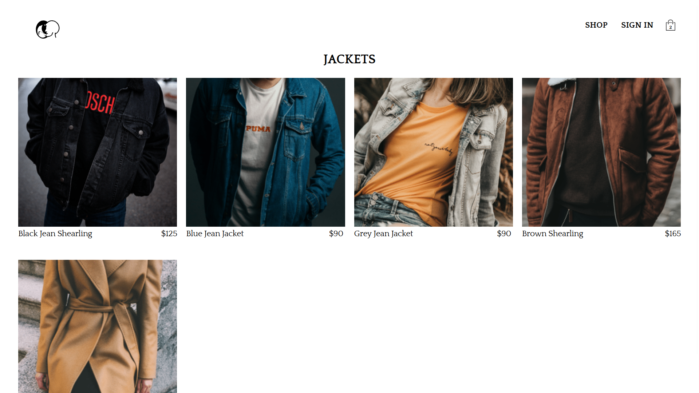

# Mirror Clothing

A modern e-commerce clothing store built with React, Firebase, and Styled Components. This project is part of the Zero To Mastery React Developer course.


_Main landing page showcasing clothing categories_

## Key Features & Screenshots

### Shopping Categories


_Browse the extensive collection across multiple categories_

### Smart Shopping Cart


_Real-time cart updates and quick checkout access_

### Secure Authentication


_Multiple sign-in options_

Deployment with Netlify: [https://celadon-pothos-5e3531.netlify.app/](https://celadon-pothos-5e3531.netlify.app/)

## Features

- Browse clothing categories (Hats, Jackets, Sneakers, Mens, Womens)
- Shopping cart functionality with real-time updates
- User authentication with email/password and Google sign-in
- Category-based product filtering
- Built following ZTM React best practices and patterns

## Technologies Used

- React 18
- Firebase Authentiction & Firestore
- Styled Components
- React Router DOM
- React Context for state management

### Future Technologies

- Redux
- Stripe
- GraphQL

## Prerequisites

- Node.js (v14 or higher)
- npm or yarn
- Firebase account

## Getting Started

1. Clone the repository:

```bash
git clone https://github.com/yourusername/mirror-clothing.git
```

2. Install dependencies:

```
cd mirror-clothing
npm install
```

3. Running the app

```bash
npm start
```

The app will run on http://localhost:3000/

## Licence

This project is licensed under the MIT License - see the LICENSE file for details
